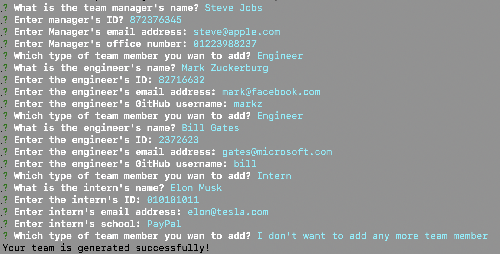
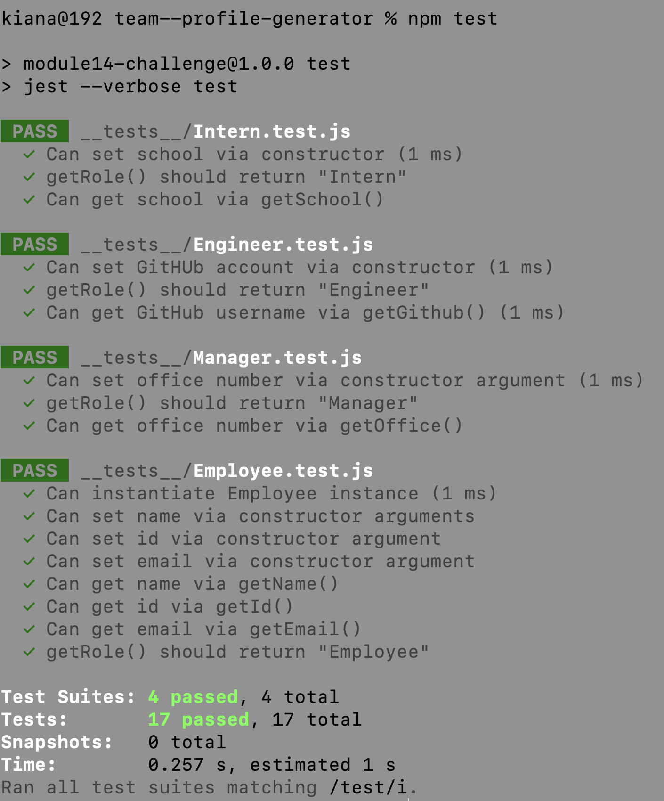

# Team Profile Generator

## Description
This application is a Node.js command-line application to take in information about employees on a software engineering team, then generates an HTML webpage that displays summaries for each person.

## Table of Contents
- [Installation](#installation)
- [Usage](#usage)
- [Credits](#credits)
- [Tests](#tests)


---
## Installation
First you need to run following command in project's root to install dependencies:

```
npm install
```


To run the application run following command in project's root:

```
node index.js
```


---
## Usage

The following image shows a mock-up of the generated HTML’s appearance and functionality:

### Data entry in command line: 



### Output: 


### And if tests will be passed successfully: 



---
## Credits

- Developer: [@kianamsqt](https://github.com/KianaMsqt)
- https://nodejs.org/api/fs.html
- https://www.npmjs.com/package/inquirer

---
## Tests

To run test run following command in the project's root:

```
npm test
```
